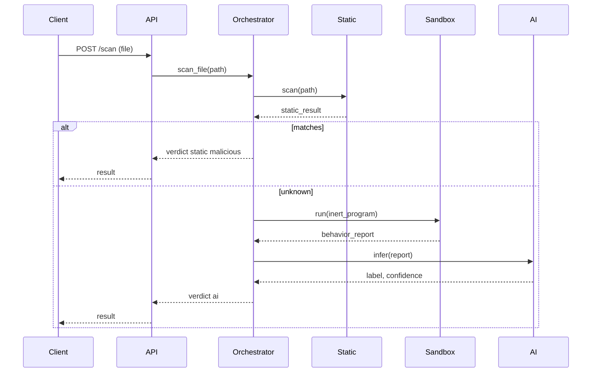
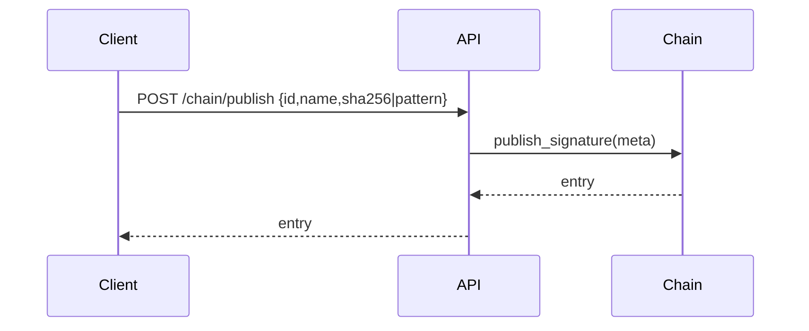

# DragonShield Architecture

## High-level Diagram
```mermaid
graph TD
A[File Input] --> B[Static Scanner]
B -- Known --> V1[Verdict: Malicious]
B -- Unknown --> C[Sandbox Simulator]
C --> D[Behavior Features]
D --> E[AI Classifier]
E --> V2[Verdict: Benign/Malicious]
V1 -->|Opt-in| F[Publish Signature Metadata]
V2 -->|Opt-in| F
F --> G[Mock Blockchain (JSON-backed)]
```

## Modules
- UI Client: Minimal static HTML served by API.
- Core Engine:
	- Static Scanner: hash and pattern matches, basic PE metadata.
	- Sandbox Orchestrator: runs inert sample program and records simulated events.
	- AI Analyzer: feature extraction + logistic regression classifier.
- Signature DB: JSON file (`dragonshield/signatures.json`).
- Blockchain Module: Mock client persisting signature metadata locally, exposed via API routes.
- Backend API: FastAPI app with `/scan`, `/signatures`, `/chain/*`.

## Data Flows
### File Scan Sequence


### Dynamic Analysis
- Executes a safe, inert Python program.
- Collects stdout, exit code, and simulated file/net events.
- Produces JSON report consumed by feature extractor.

### Signature Publish


## APIs
- `/scan` POST multipart file -> JSON verdict.
- `/signatures` POST JSON -> append to local DB.
- `/chain/signatures` GET -> list entries.
- `/chain/publish` POST -> publish metadata.
