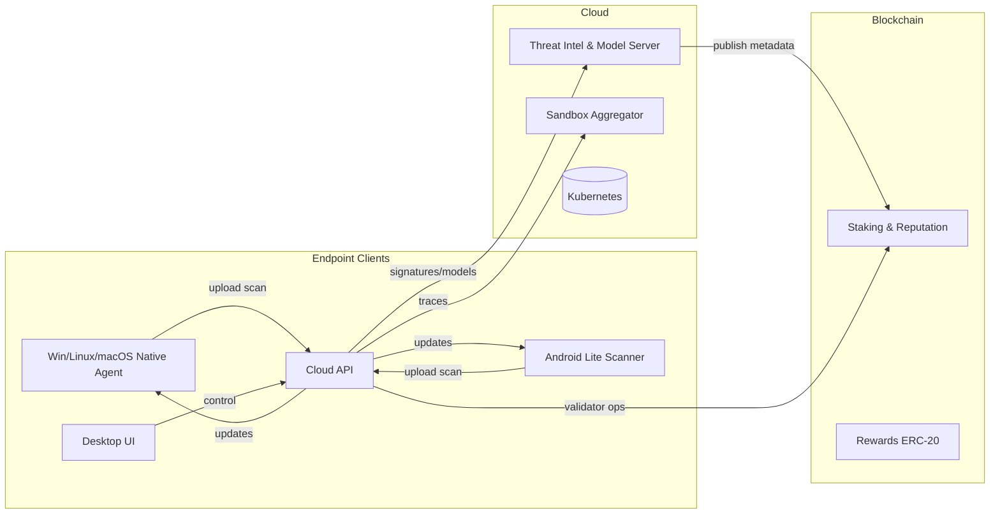

# DragonShield v2.0 Architecture

## High-level (Client-Cloud-Chain)

## Key Components
- Endpoint Agents: native Rust client + Python fallback, Android lite scanner.
- Cloud Services (FastAPI): API Gateway, Threat Intel Server, Sandbox Aggregator, Model Registry.
- Data Stores: PostgreSQL (cloud), MinIO/S3 for artifacts, Redis for queues.
- Blockchain: staking, reputation, and rewards contracts (testnet/mainnet ready).

## Flows
### Scan & Verdict (Endpoint)
1) Agent runs advanced static scan (hash, patterns, entropy, PE heuristics).
2) If unknown/risky, send sample metadata + simulated behavior report to Cloud.
3) Cloud runs AI inference (sequence model), returns verdict, pushes telemetry encrypted.

### Updates Distribution
- Cloud publishes signed signature/model delta bundles via CDN.
- Agents verify signatures, apply delta.

### Blockchain Publishing
- Validators stake, vote on signature metadata.
- Accepted entries reward submitters via ERC-20.
